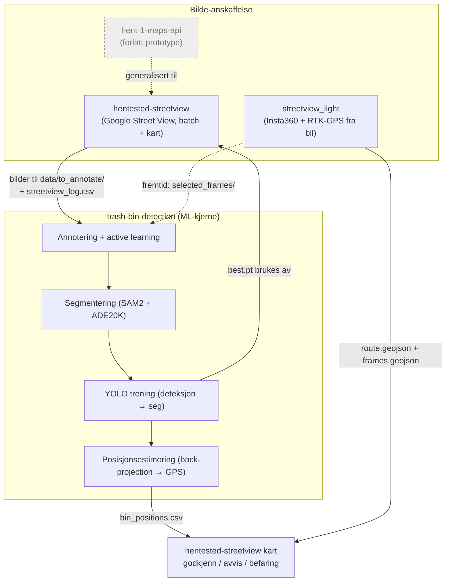
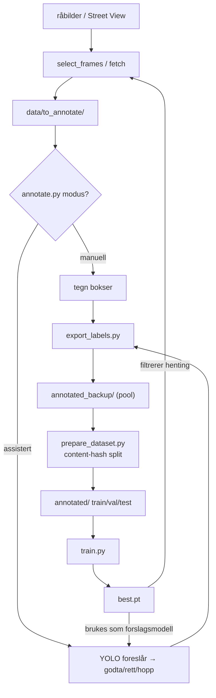
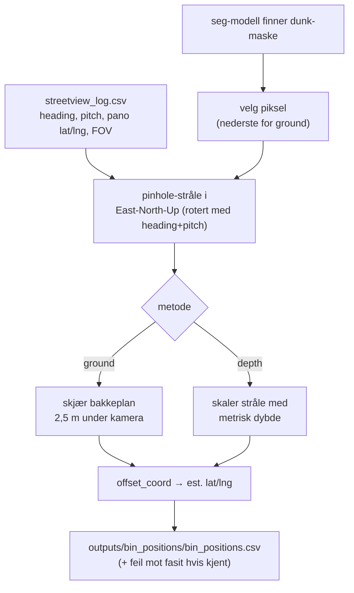
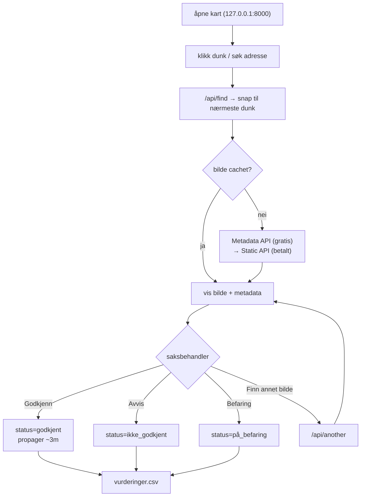
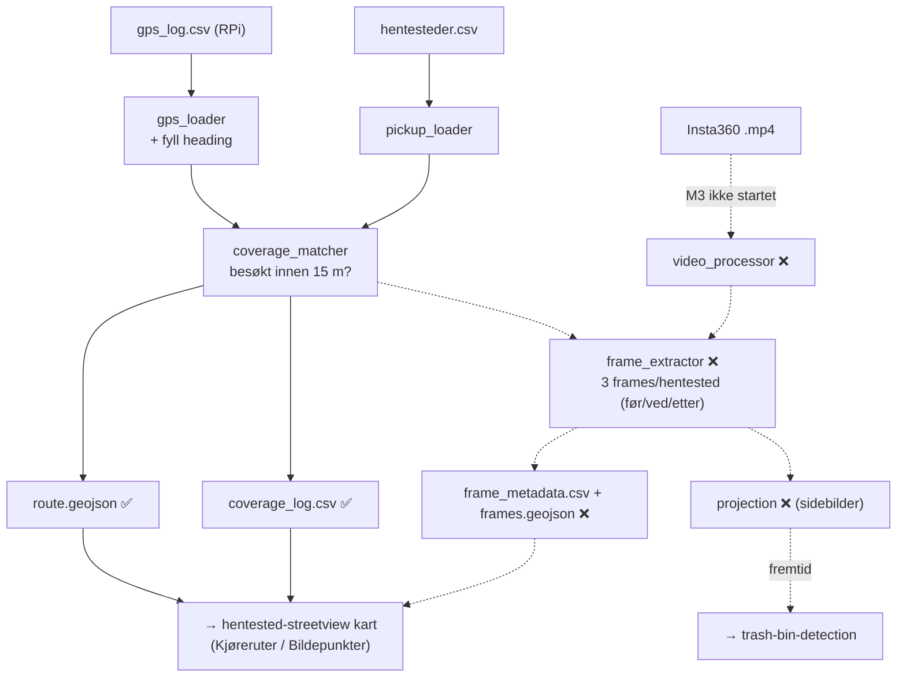

# Prosjektoversikt — Deteksjon og lokalisering av hentesteder (REN, Oslo kommune)

> Generert oversikt over hele prosjekt-økosystemet pr. **2026-06-29**.
> Dette dokumentet **beskriver** bare — ingen kode er endret.
> `fotogrametri`-prosjektet er bevisst holdt utenfor.

---

## Innhold

1. [Hva er dette egentlig?](#1-hva-er-dette-egentlig)
2. [Økosystemet: fire delprosjekter](#2-økosystemet-fire-delprosjekter)
3. [Overordnet dataflyt](#3-overordnet-dataflyt)
4. [trash-bin-detection — kjernen (ML)](#4-trash-bin-detection--kjernen-ml)
5. [hentested-streetview — godkjenningskart + Street View-henting](#5-hentested-streetview--godkjenningskart--street-view-henting)
6. [insta360-implementasjon / streetview_light — egne bilder fra bil](#6-insta360-implementasjon--streetview_light--egne-bilder-fra-bil)
7. [hent-1-maps-api — forlatt prototype](#7-hent-1-maps-api--forlatt-prototype)
8. [Status: implementert vs. gjenstående](#8-status-implementert-vs-gjenstående)
9. [Miljø og verktøy](#9-miljø-og-verktøy)
10. [Hurtigreferanse: nøkkelfiler](#10-hurtigreferanse-nøkkelfiler)

---

## 1. Hva er dette egentlig?

Målet er å **finne og verifisere hentesteder for avfall** (søppeldunker / standplasser) i
Oslo for **Renovasjons- og gjenvinningsetaten (REN)**, og å estimere deres faktiske
GPS-posisjon fra bilder.

Det består av to spor som møtes i samme YOLO-modell og samme kart:

- **Bilde-anskaffelse**: Skaffe gatebilder av hentesteder — enten gratis-ish fra Google
  Street View, eller egeninnsamlet med en takmontert Insta360 + RTK-GPS på bil.
- **Maskinlæring**: Trene en YOLO-modell (deteksjon → segmentering) som finner dunker i
  bildene, og bruke kamerageometri til å regne ut hvor dunken faktisk står (lat/lng).
- **Menneskelig QA**: Et Leaflet-kart der saksbehandler godkjenner / avviser / sender på
  befaring hvert hentested.

Den langsiktige visjonen (i `PROJECT.md`) er **3D romlig vurdering** av hentesteder —
ikke bare «finnes det en dunk», men nøyaktig posisjon og tilgjengelighet.

---

## 2. Økosystemet: fire delprosjekter

| Prosjekt | Mappe | Rolle | Tilstand |
|---|---|---|---|
| **trash-bin-detection** | `trash-bin-detection/` | ML-kjernen: annotering, trening, segmentering, posisjonsestimering, kart-henting | Aktiv |
| **hentested-streetview** | `hentested-streetview/` | Leaflet-kart for godkjenning + batch-henting av Street View-bilder | Aktiv, moden |
| **insta360-implementasjon** | `insta360-implementasjon/streetview_light/` | Egeninnsamling: Insta360 + GPS → geolokaliserte bildepunkter | Under bygging (M1/M2 ferdig) |
| **hent-1-maps-api** | `hent-1-maps-api/` | Engangs-skript, hardkodet adresse — feilnavngitt, **ikke** en API | Forlatt prototype |



**Viktig nyanse:** `hent-1-maps-api` heter «...-api» men er **ikke** en server eller API.
Det er ett enkelt skript (`hent_bilde.py`) som hentet 4 Street View-bilder av én hardkodet
adresse («Asaktoppen 16», sist kjørt 2026-06-18) og så ble forlatt. Konseptet ble
generalisert til `hentested-streetview`. Ikke rut noe gjennom det.

---

## 3. Overordnet dataflyt

```mermaid
flowchart LR
    CSV["hentesteder CSV<br/>(REN-eksport, lat/lng)"]

    subgraph fetch["Henting"]
        SVFETCH["fetch_streetview_from_csv.py<br/>sikter kamera mot dunk"]
        TRIAGE["sort_by_detection.py<br/>has_bins / no_bins"]
    end

    subgraph label["Annotering"]
        TOANN["data/to_annotate/"]
        ANNOT["annotate.py<br/>(manuell + assistert)"]
        POOL["data/annotated_backup/<br/>(master-pool)"]
        SPLIT["prepare_dataset.py<br/>(content-hash split)"]
        ACTIVE["data/annotated/<br/>train/val/test"]
    end

    subgraph segstep["Segmentering"]
        SAM["SAM2 (dunk) + ADE20K (bakke)"]
        ANNSEG["data/annotated_seg/"]
    end

    subgraph trainstep["Trening / eval"]
        TR["train.py / train_seg.py"]
        WEIGHTS["best.pt"]
        EVAL["evaluate.py"]
    end

    POSEST["estimate_bin_positions.py<br/>back-projection → GPS"]
    MAPF["map_fetch.py / hentested-kart"]

    CSV --> SVFETCH --> TRIAGE --> TOANN
    TOANN --> ANNOT --> POOL --> SPLIT --> ACTIVE
    ACTIVE --> SAM --> ANNSEG --> TR --> WEIGHTS
    WEIGHTS --> EVAL
    WEIGHTS --> SVFETCH
    WEIGHTS --> POSEST --> MAPF
```



Selve **kjernen i prosjektets idé** er en lukket *active learning*-løkke: hent bilder →
modell foreslår bokser → menneske retter → tren på nytt → bedre forslag. Hver runde skal
gi færre rettelser.

---

## 4. trash-bin-detection — kjernen (ML)

Den faktiske ML-pipelinen. Klasser: deteksjon har **én** klasse (`0 = trash_bin`),
segmentering har **to** (`0 = trash_bin`, `1 = ground`).

### 4.1 Mappestruktur (utvalg)

```
trash-bin-detection/
├── configs/            data.yaml (deteksjon), data_seg.yaml (seg)
├── data/
│   ├── raw/            originale videoer/bilder (kun-les)
│   ├── to_annotate/    kø for nye bilder
│   ├── annotated_backup/  master-pool (fasit)
│   ├── annotated/      aktiv train/val/test (bygges av prepare_dataset.py)
│   ├── annotated_seg/  segmenteringslabels (SAM2 + ADE20K)
│   ├── hentesteder_chunks/  oppdelte CSV-er
│   └── streetview_log.csv   manifest: kamerapose, GPS, deteksjonsconf
├── models/             trained/ + pretrained/ (SAM2.1, Depth Anything)
├── notebooks/          Colab-arbeidsflyter
├── outputs/            evaluering, bin_positions.csv, overlays
├── runs/               Ultralytics-output (detect/ + segment/)
└── src/                hovedmodulene (se under)
```

### 4.2 Moduler i `src/`

**Annotering og datasett**
- `labeling/select_frames.py` — kopierer et utvalg råbilder til `to_annotate/`.
- `labeling/annotate.py` — OpenCV-GUI med to moduser:
  - *manuell*: tegn bokser fra bunnen (`s`=lagre, `b`=bakgrunn, `z`=angre, `c`=tøm, `Esc`=hopp).
  - *assistert*: gjennomgå YOLO-forslag (`a`=godta, `r`=avvis+tegn på nytt, `s`=hopp).
    Viser et «treffsikkerhet»-merke (grønn ≥80 %, oransje ≥50 %, rød <50 %).
- `labeling/export_labels.py` — kopierer ferdige par fra `to_annotate/` til master-poolen.
- `prepare_dataset.py` — bygger `data/annotated/` på nytt. Grupperer bilder etter
  **MD5-innholdshash** (ikke filnavn), og splitter enkelt-bilder ~70/15/15 (train/val/test)
  med `verify_no_content_leak()` som garanterer disjunkte splitter.
- `extract_frames.py` — trekker ut hvert N-te bilde (default 30) fra video til `data/raw/images/`.

> **Merknad om «hard example mining»:** Koden i `prepare_dataset.py` har fortsatt logikk
> for å låse innholds-duplikater (`_h2`, `_h3`...) til train. Men **oversampling ble droppet
> 2026-06-22** og alle datasett ble deduplisert til én kopi per innholdshash. Den logikken
> er nå reelt sett en no-op (ingen duplikater igjen). `CLAUDE.md` sin mining-seksjon er
> dermed utdatert. Siste kjente størrelser: pool 398, aktiv 397 (train 309 / val 44 /
> test 44), seg 41 unike bilder.

**Segmentering (SAM2 + ADE20K)**
- `labeling/sam2_seg_autolabel.py` — auto-labeler masker fra deteksjonsbokser:
  - **SAM2** (lokal, gratis): bokser → instansmaske per dunk.
  - **ADE20K SegFormer-B5** (`nvidia/segformer-b5-finetuned-ade-640-640`): semantisk
    scene, slår sammen «bakke»-klasser (road, sidewalk, pavement, grass, earth, …) til én
    bakke-maske; piksler under dunk-masker fjernes.
  - Kvalitetsflagging (`assess_bin_mask`): flagger hvis conf < 0.70, maske < 10 % av boks,
    eller tom maske. Skriver YOLO-seg polygoner + preview-bilder.
- `labeling/seg_precompute.py` — kjør SAM2+semantikk lokalt og **cache** til pickle (crash-trygt, resumbart).
- `labeling/seg_cache_review.py` / `sam2_seg_review.py` / `review_precomputed.py` — gjennomgå
  masker (henholdsvis fra cache offline, interaktivt med prefetch, eller eldre JSON-format).
  Kontroller: `a`=godkjenn, `s`=hopp, `f`=flagg, `o`=veksle overlay.

**Trening og evaluering**
- `train.py` — YOLO**11n** deteksjon. Default 50 epoker, batch 8, imgsz 640, patience 20.
  Vekter havner i `runs/detect/models/trained/<run>/weights/best.pt` (Ultralytics legger
  på `runs/detect/`-prefiks).
- `train_seg.py` — YOLO**11n-seg** på to klasser, leser `configs/data_seg.yaml`, lagrer til
  `runs/segment/...`.
- `evaluate.py` — kjører `model.val()` på **test**-splitten, rapporterer P / R / mAP50 / mAP50-95,
  plott til `outputs/evaluation/`.

**Henting, triage og posisjonsestimering**
- `fetch_streetview.py` — Street View fra adresser/koordinater i tekstfil.
- `fetch_streetview_from_csv.py` — **sikter kamera mot eksakt dunk-koordinat**: gratis
  Metadata-API → finn nærmeste panorama → regn ut heading (panorama→dunk) og pitch (fra
  avstand/kamerahøyde). Hopper over utilgjengelige standplasser (låst dør, trapp, søppelrom…).
  Retry mot nest-nærmeste panorama hvis ingen deteksjon. Logger til `streetview_log.csv`.
- `sort_by_detection.py` — triagerer hentede bilder i `has_bins/` og `no_bins/` med seg-modellen.
- `estimate_bin_positions.py` — **back-projection** fra deteksjon → GPS (se diagram under).
- `map_fetch.py` — interaktivt Leaflet-kart (lokal `http.server`): klikk → snap til nærmeste
  dunk → hent/gjenbruk Street View → kjør seg-modell → back-project → vis overlay + estimert posisjon.
- `split_hentesteder.py` — deler stor CSV i biter (default 1000 punkter) for å holde API-kost nede.
- `streetview_stats.py` — hvor ofte andre-forsøk-panorama gir treff.

### 4.3 Annoterings- / active-learning-løkken



### 4.4 Segmentering: bokser → masker

```mermaid
flowchart LR
    DET["deteksjonslabels<br/>(bokser, klasse 0)"]
    IMG["bilde"]
    IMG --> SAM["SAM2<br/>boks → dunk-maske"]
    DET --> SAM
    IMG --> SEM["ADE20K SegFormer-B5<br/>semantisk scene"]
    SEM --> GROUND["slå sammen bakke-klasser<br/>→ bakke-maske"]
    SAM --> CLIP["fjern bakke under dunk"]
    GROUND --> CLIP
    CLIP --> POLY["mask_to_polygons<br/>→ YOLO-seg format"]
    POLY --> OUT["annotated_seg/<br/>klasse 0=dunk, 1=bakke"]
    SAM -. conf<0.70 / liten maske .-> FLAG["flagg for manuell review"]
```

### 4.5 Posisjonsestimering (back-projection → GPS)

To metoder, valgt via `--method`:
- **ground** (default, **~2,3 m median feil**): stråle gjennom dunkens nederste piksel
  treffer flatt bakkeplan 2,5 m under kamera.
- **depth** (~22 m feil): metrisk dybde fra Depth Anything V2, sentroide-piksel.
- **both**: prøv ground først, fall tilbake til depth hvis avstand > grense.



### 4.6 Colab-notebooks (`notebooks/`)
- `colab_workflow.ipynb` — oppsett + trening i Colab (laster `data.zip` fra Drive).
- `seg_train_colab.ipynb` — dedikert seg-trening.
- `seg_precompute_review.ipynb` — SAM2+ADE20K precompute + interaktiv review.
- `sam2_review.ipynb` — eldre SAM2-maskereview.
- `inspect_dataset.ipynb` — EDA / labelvisualisering.

---

## 5. hentested-streetview — godkjenningskart + Street View-henting

Det **modne, produksjonsnære** prosjektet. Ingen ML her — kun datainnsamling (CSV → bilder)
og menneskelig QA via kart. Stack: Python stdlib `http.server` + Leaflet 1.9.4, ingen
byggesteg, HTML/JS ligger som én stor streng i `map_server.py` (~1500 linjer).

### 5.1 Moduler i `src/`
- `map_server.py` — den interaktive serveren (se ruter under).
- `hentesteder.py` — CSV-parsing (auto-detekterer `;` vs `,`, norsk `"59,9474"`→float),
  `BinIndex` (vektorisert nærmeste-nabo via numpy/haversine), dedup på 6-desimalers koordinat,
  `skip_reason`/`special_notes` (skjult dunk: låst dør, trapp, lang henteavstand…).
- `approvals.py` — lagrer vurderinger til `data/vurderinger.csv` (status + tidsstempel),
  migrerer fra eldre `approved_hentesteder.csv`.
- `streetview.py` — Google-geometri: `bearing`, `haversine_m`, `auto_pitch` (kamerahøyde
  2,5 m, mål 0,5 m), `aim_at`, `second_nearest_pano` (finn alternative panoramaer via
  ringe-/retnings-offset), gratis Metadata vs. betalt Static API.
- `fetch_from_csv.py` — batch-henting fra CSV-chunks (cache, dedup, tilgangsfilter, `--dry-run`, `--limit`).
- `fetch_from_addresses.py` — henting fra adresse/koordinat-tekstfil; sletter linje ved suksess.
- `fetch_log.py` — `streetview_log.csv` (gjenbruk uten nye API-kall).
- `paths.py` — sentrale stier.

### 5.2 HTTP-ruter (`map_server.py`)

| Rute | Hva den gjør |
|---|---|
| `/` | HTML + Leaflet-kart (Oslo-branding) |
| `/api/find` | snap klikk til nærmeste dunk, hent/gjenbruk Street View-bilde |
| `/api/another` | neste nærmeste panorama (bildeserie) |
| `/api/nearest` | naviger til neste dunk med gitt status |
| `/api/random` | tilfeldig dunk (respekterer filtre) |
| `/api/points` | dunker i synlig kartområde (maks 800) |
| `/api/assess` | sett/veksle status + propager innen ~3 m |
| `/api/geocode` | geokod adresse (Oslo-vektet) |
| `/api/stats` | statistikk (godkjent/avvist/fraksjoner/notater) |
| `/api/list` | list dunker med gitt status |
| `/api/coverage` | GeoJSON kjøreruter (fra `data/coverage/*.geojson`) |
| `/api/frames` | GeoJSON bildepunkter (kameraposisjoner) |
| `/cache/<fil>` | server cachet Street View-JPEG |

### 5.3 Godkjenningsflyt

Tre statuser: `godkjent` (grønn), `ikke_godkjent` (rød), `på_befaring` (lilla), pluss
uvurdert (blå/grå). Godkjenning **propagerer** til naboer innen ~3 m (ett nivå dypt).
Klikk samme knapp igjen = veksle tilbake til uvurdert. Hver endring skrives umiddelbart
(trådsikkert) til `data/vurderinger.csv`.



### 5.4 Kart-overlegg fra egeninnsamling
`map_server.py` har **coverage-overlegg** (lagt til 2026-06-29): `/api/coverage` og
`/api/frames` slår sammen alle `*.geojson` i `--coverage-dir` (default `data/coverage/`) til
to slåbare Leaflet-lag — **«Kjøreruter»** og **«Bildepunkter»**. Hit leverer
`streetview_light` sine `route.geojson` / `frames.geojson` så man ser hvor bilen har kjørt
og hvilke hentesteder som mangler dekning.

---

## 6. insta360-implementasjon / streetview_light — egne bilder fra bil

Eget innsamlings-spor: takmontert **Insta360 + RTK-GPS** på bil → match kjørt rute mot
hentesteder → trekk ut sidebilder kun der bilen passerte et hentested → mat inn i
YOLO-pipelinen senere. Ligger i `insta360-implementasjon/streetview_light/`.

To deler:

### 6.1 `rpi_gps_logger/` — **ferdig**
Kjører på en Raspberry Pi i bilen, leser NMEA fra en u-blox RTK-mottaker over serieport og
skriver **én CSV per kjøreøkt**, én rad per sekund:
- `nmea_reader.py` — bakgrunnstråd, parser GGA (posisjon/høyde/fix/satellitter), RMC
  (tid/heading/fart), GST (nøyaktighet); auto-rekobler ved frafall.
- `csv_writer.py` — `gps_log_YYYYMMDDThhmmss.csv` med kolonner
  `timestamp,lat,lon,altitude,accuracy,heading,speed`, flusher hver rad (strømbrudd-trygt).
- `logger.py` / `config.py` / `gps_fix.py` — orkestrering, config, delt fix-tilstand.

### 6.2 `streetview_light/` — **delvis**
Pipeline orkestrert av `main.py` over modulene i `src/`:

| Modul | Funksjon | Status |
|---|---|---|
| `gps_loader.py` | last GPS-logg, fyll manglende heading fra bevegelse | ✅ |
| `pickup_loader.py` | last hentesteder-CSV | ✅ |
| `geo_utils.py` | haversine + bearing (vektorisert) | ✅ |
| `coverage_matcher.py` | match hentested mot rute innen `pickup_radius_meters` (15 m) | ✅ |
| `output_writer.py` | `write_coverage_log` + `write_route_geojson` | ✅ delvis |
| `video_processor.py` | åpne video, GPS-tid ↔ video-tid | ❌ stub |
| `frame_extractor.py` | trekk ut frames i tidsvindu rundt nærmeste GPS-punkt | ❌ stub |
| `output_writer` (frames) | `write_frame_metadata` + `write_frames_geojson` | ❌ stub |
| `projection.py` | 360°/fisheye → rektilineære sidebilder | ❌ planlagt (etter MVP) |



**Sentrale beslutninger (fra minne, 2026-06-29):**
- **Tidssynk:** Sjekk **først** om video/.insv-metadata har absolutt veggklokke-tid → juster
  GPS↔video direkte på klokketid. Kun hvis fraværende: fall tilbake på antakelsen «startet
  samtidig» (video-start = første GPS-tidsstempel) + `camera_time_offset_seconds` finjustering.
- GPS logges 1 Hz. Støtt **både** ett sammensydd `.mp4` og to linse-/retningsvideoer.
- 360→sidebilder utsatt forbi MVP; MVP lagrer hele frames.
- **Milepæler:** M1 (GPS/match/route) ✅ verifisert · M2 (kart-overlegg) ✅ verifisert ·
  **M3 (video → frames) er neste, ikke startet.**
- ⚠️ Miljø-felle: `pandas 3.0.4 + numpy 2.4.6 + Python 3.14` → `pd.Timestamp(numpy.datetime64)`
  **segfaulter**. Indekser pandas-Series direkte (`series.iloc[i]`) i stedet.

---

## 7. hent-1-maps-api — forlatt prototype

Ett skript, `hent_bilde.py`: geokod hardkodet adresse «Asaktoppen 16» → hent Street
View-bilde (640×480, fov 120) → lagre `bilder/asaktoppen_16_N.jpg`. Ingen git, ingen README,
ingen parametre. Kjørt 4 ganger 2026-06-18, så forlatt. Konseptet lever videre i
`hentested-streetview`. **Bruk ikke dette til noe.**

---

## 8. Status: implementert vs. gjenstående

**Ferdig og i bruk**
- ✅ Hele Street View-hentingen (adresse, CSV-sikting mot dunk, batch, cache, tilgangsfilter)
- ✅ Annoteringsverktøy (manuell + modell-assistert), eksport, content-hash-split
- ✅ Segmentering SAM2 + ADE20K (batch, lokal precompute, flere review-verktøy)
- ✅ Trening (deteksjon + seg) og evaluering
- ✅ Posisjonsestimering (ground ~2,3 m, depth-fallback) → `bin_positions.csv`
- ✅ `map_fetch.py` interaktivt klikk→detekter→GPS-kart
- ✅ Hentested-godkjenningskartet (3 statuser, propagering, statistikk, bildeserier, coverage-lag)
- ✅ RPi GPS-logger (NMEA → CSV, auto-rekobling)
- ✅ streetview_light M1 (GPS/match/route) + M2 (kart-overlegg)

**Gjenstår / planlagt**
- ⏳ **streetview_light M3**: video → frames (`video_processor`, `frame_extractor`,
  `write_frame_metadata`, `write_frames_geojson` er stubs) — kritisk manglende bit for
  egeninnsamlings-sporet.
- ⏳ `projection.py`: 360→rektilineære sidebilder (etter MVP).
- ⏳ Koble streetview_lights `selected_frames/` faktisk inn i `to_annotate/`.
- ⏳ `src/inference.py`, `src/utils/*` i trash-bin-detection er tomme plassholdere.
- ⏳ Langsiktig: full 3D romlig vurdering (`PROJECT.md`).

**Utdatert dokumentasjon å være obs på**
- ⚠️ `CLAUDE.md` sin **mining/oversampling-seksjon** og «never delete»-regelen for
  `annotated_backup/` er overstyrt av beslutningen 2026-06-22 (mining droppet, alt
  deduplisert). `prepare_dataset.py` sin lås-til-train-logikk er nå en no-op.

---

## 9. Miljø og verktøy

- **Python:** alle avhengigheter (`ultralytics`, `torch`, `opencv`, `numpy`, `transformers`,
  `requests`) ligger i **global Python 3.14**, *ikke* i `.venv` (den er tom). Kjør alt med
  `py -3.14 -m src.<modul>`.
- **Trente vekter:** `runs/detect/models/trained/<run>/weights/best.pt` (Ultralytics legger
  på `runs/detect/`-prefiks foran `project=models/trained`).
- **Google API:** krever `GOOGLE_MAPS_API_KEY` i miljøet. Metadata-API er gratis, Static
  Street View ~7 USD per 1000 bilder → derav chunking og cache.
- **Git/hygiene:** data, bilder, videoer og vekter (`.pt`/`.onnx`/…) holdes utenfor versjonskontroll.

---

## 10. Hurtigreferanse: nøkkelfiler

| Fil | Formål |
|---|---|
| `trash-bin-detection/src/train.py` | YOLO deteksjonstrening |
| `trash-bin-detection/src/train_seg.py` | YOLO segmenteringstrening |
| `trash-bin-detection/src/prepare_dataset.py` | bygg splitter (content-hash dedup) |
| `trash-bin-detection/src/labeling/annotate.py` | manuell + assistert annotering |
| `trash-bin-detection/src/labeling/sam2_seg_autolabel.py` | SAM2 + ADE20K maske-autolabel |
| `trash-bin-detection/src/estimate_bin_positions.py` | back-projection deteksjon → GPS |
| `trash-bin-detection/src/map_fetch.py` | interaktivt klikk→detekter→GPS-kart |
| `trash-bin-detection/src/fetch_streetview_from_csv.py` | Street View siktet mot dunk |
| `trash-bin-detection/data/streetview_log.csv` | manifest: kamerapose + GPS + conf |
| `hentested-streetview/src/map_server.py` | Leaflet godkjenningskart (alle ruter) |
| `hentested-streetview/src/streetview.py` | Google-geometri + Metadata/Static API |
| `hentested-streetview/data/vurderinger.csv` | lagrede godkjenninger (3 statuser) |
| `insta360-implementasjon/streetview_light/main.py` | innsamlings-pipeline (M1/M2) |
| `insta360-implementasjon/streetview_light/rpi_gps_logger/` | RPi NMEA→CSV-logger |
| `hent-1-maps-api/hent_bilde.py` | forlatt engangs-skript (ignorer) |
```
